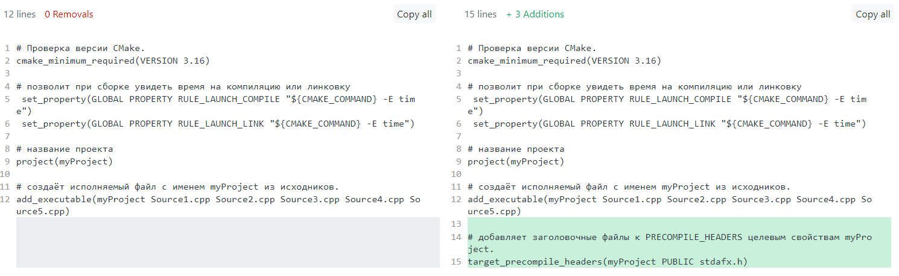

# Как сделать предварительно cкомпилированные заголовочные файлы. Какой эффект они дают.

**Зачем нужны предварительно откомпилированные заголовочные файлы?**

При компиляции большого количества исходных файлов компилятор
выполняет множество раз одну и ту же работу по разбору тяжеловесных
заголовков (например, iostream). Основная идея заключается в том, чтобы
вынести эти тяжеловесные заголовки в отдельный файл, который
компилируется единожды и затем включается во все единицы
трансляции самым первым.

**Как работают?**

Файл, который содержит precompiled headers, имеет расширение ".pch".

Файл \*.pch возникает после компиляции stdafx.cpp. Файл собирается с
ключом "/Yc". Этот ключ как раз и говорит компилятору, что нужно создать
precompiled headers. Файл stdafx.cpp может содержать одну строчку:
\#include "stdafx.h".

В файле "stdafx.h" находятся заголовочные файлы, которые будут заранее препроцессироваться.

### Как создать предкомипированный заголовочный файл в Visual Studio.

Создала проект *with\_pch.*. В нём есть один Source.cpp файл.

Для всех .cpp файлов включаем использование precompiled headers. Это
делается на вкладке проект -&gt; свойства -&gt; свойства конфигурации
-&gt; c/c++ -&gt; предварительно откомпилированный заголовок:

\* Выставляем для параметра "Precompiled Header" значение "Use (/Yu)".

\* Для параметра "Precompiled Header File" указываем "stdafx.h".

\* Для параметра "Precompiled Header Output File" указываем
"\$(IntDir)\$(TargetName).pch".

Создаём и добавляем в проект файл stdafx.h. В него мы будем включать те
заголовочные файлы, которые хотим заранее препроцессировать.

Создаём и добавляем в проект файл stdafx.cpp. В нём одна единственная
строка: \#include "stdafx.h".

Для файла stdafx.cpp выставляем для параметра "Precompiled Header"
значение "Create (/Yc)".

Заголовочный файл "stdafx.h" должен включаться в исходные файл самым
первым.

Включать в "stdafx.h" только те файлы, которые никогда не изменяются или
меняются ОЧЕНЬ редко. Хорошими кандидатами являются заголовочные файлы
системных и сторонних библиотек.

### С помощью CMake создание инструкции для сборки проектов с предкомпилированным заголовком и без. Сборка проектов, используя разные компиляторы (gcc, clang, msvc).

*CMake* - кроссплатформенное программное средство автоматизации сборки
программного обеспечения из исходного кода. Не занимается
непосредственно сборкой, а лишь генерирует файлы сборки из
предварительно написанного файла сценария CMakeLists.txt и предоставляет
простой единый интерфейс управления. Помимо этого, способно
автоматизировать процесс установки и сборки пакетов.

CMake может создавать файлы проектов для нескольких популярных интегрированных средств разработки. Может создавать сценарии
сборки для MSBuild и nmake в Windows, make на Unix-подобных системах.
CMake поддерживает обширный список компиляторов, в который входят в том
числе Clang, GNU GCC, MSVC.

Сборка программы с помощью CMake представляет собой двухэтапный процесс.
На первом этапе стандартные файлы сборки генерируются из файлов
конфигурации (CMakeLists.txt), которые написаны на языке CMake. Затем
задействуются системные инструменты сборки, такие как make, msbuild,
используемые для непосредственной компиляции программ.

**Подготовка исходных файлов**

Проект состоит из Source.cpp и stdafx.h.

*Source.cpp*
```
#include "stdafx.h"

int main()
{
    std::string s = "Hello World!\n";
    std::string sub1 = s.substr(0, 5);
    std::string sub2 = s.substr(6, 5);
    std::cout << s;
    std::map <std::string, std::string> book = { {"Hi", "Привет"},
                             {"Student", "Студент"},
                             {"!", "!"} };
    book["num_1"] = "num_2";
}
```

*stdafx.h*
```
#pragma once

#include <iostream>
#include <map>
#include <string>
```

Необходимо в корне дерева исходников разместить файл CMakeLists.txt,
хранящий правила и цели сборки.

*CMakeLists.txt:*
```
# проверка версии CMake. 
cmake_minimum_required(VERSION 3.16)

# название проекта
project(myProject)

# создаёт исполняемый файл с именем myProject из исходника Source.cpp.
add_executable(myProject Source.cpp)
```

Теперь сделаем stdafx.h предкомпилированным заголовочным файлом. 
Для этого добавим команду target_precompile_headers(myProject PUBLIC stdafx.h).  
Команда target_precompile_headers добавляет заголовочные файлы (а именно stdafx.h) к PRECOMPILE_HEADERS целевым свойствам myProject. Именованный объект myProject должен быть создан с помощью такой команды, как add_executable() или add_library(), и не должен быть целевым псевдонимом.

Изменения в *CMakeLists.txt*:



**Сборка проекта средствами CMake в командной строке Linux**

Исходные файлы находятся в папке ~/practice_unix/with_pch. 
Создадим пустую директорию tmp для временных файлов и перейдём туда.

> belkalia@DESKTOP-A1S40CT:\~/practice\_unix/tmp\$

Теперь запустим команду cmake, передав ей в качестве параметра путь к
папке с исходниками:

> belkalia@DESKTOP-A1S40CT:\~/practice\_unix/tmp\$ cmake ../with\_pch  
> …  
> -- Build files have been written to: /home/belkalia/practice\_unix/tmp

Видим, что в папке появилось несколько временных файлов, необходимых для
сборки проекта.  
Теперь можно запустить непосредственно make. Чтобы узнать время выполнения команды make (т.е. время сборки всего проекта), необходимо вызвать команду time:

> belkalia@DESKTOP-A1S40CT:\~/practice\_unix/tmp\$ time make  
> [ 33%] Building CXX object CMakeFiles/myProject.dir/cmake_pch.hxx.gch  
> [ 66%] Building CXX object CMakeFiles/myProject.dir/Source.cpp.o  
> [100%] Linking CXX executable myProject  
> [100%] Built target myProject  
>  
> real    0m2.144s  
> user    0m1.461s  
> sys     0m0.297s

Итак, наша программа собралась.
Можно запускать:

> belkalia@DESKTOP-A1S40CT:~/practice_unix/tmp$ ./myProject
> Hello World!

Чтобы поменять компилятор, необходимо вызвать команду *CMake* с ключом  
-D CMAKE\_C\_COMPILER=&lt;name&gt; -D CMAKE\_CXX\_COMPILER=&lt;name&gt;  
где "name" название компилятора.
Пример:
> cmake -D CMAKE\_C\_COMPILER=gcc -D CMAKE\_CXX\_COMPILER=g++ ../with_pch

**Сборка проекта средствами CMake в командной строке Windows.**

Исходные файлы находятся в папке C:\Users\belkalia\practice_win\with_pch.  
Созданим папку tmp_with в practice_win и переместимся в нее.

> C:\Users\belkalia>cd ./practice_win/tmp_with  

Выполним команду
> C:\Users\belkalia\practice_win\tmp_with>call "C:\Program Files\Microsoft Visual Studio\2022\Community\VC\Auxiliary\Build\vcvars64.bat"  
> \**********************************************************************  
> ** Visual Studio 2022 Developer Command Prompt v17.6.4  
> ** Copyright (c) 2022 Microsoft Corporation  
> \**********************************************************************

Создадим инструкции для сборки командой CMake
> C:\Users\belkalia\practice_win\tmp_with>cmake ../with_pch  
> -- Building for: Visual Studio 17 2022  
> -- Selecting Windows SDK version 10.0.19041.0 to target Windows 10.0.19045.  
> -- The C compiler identification is MSVC 19.36.32535.0  
> ...  
> -- Build files have been written to: C:/Users/belkalia/practice_win/tmp_with  

Далее соберём проект:

> C:\Users\belkalia\practice_win\tmp_with>MSBulid  myProject.sln  
> MSBuild version 17.6.3+07e294721 for .NET Framework   
> ...  
> Сборка успешно завершена.  
>    Предупреждений: 0  
>    Ошибок: 0  
>    
> Прошло времени 00:00:03.95

*Возможная проблема*  
В командной строке windows может не получиться собрать проект. Выводится такое сообщение:
> C:\\Users\\belkalia\\practice\_win\\tmp&gt;msbuild  
> "msbuild" не является внутренней или внешней командой, исполняемой программой или пакетным файлом.

Проблема решается двумя способами:

-   сначала необходимо выполнить такую команду:

> call “C:\\Program Files\\Microsoft Visual Studio\\2022\\Community\\VC\\Auxiliary\\Build\\vcvars64.bat”

-   или открыть командную строку для разработчиков VS и в ней  выполнять необходимые команды.

## Сравнение проектов с использование предкомпилированного заголовка и без.

Рассматривается несколько случаев, которые отличаются разными сочетаниями включений заголовочных файлов в исходные файлы проекта.  
Сравниваются два проекта: с использованием предкомпилированного хедера и без.

1) один исходник.

В каждом проекте есть один .cpp файл.

|                            | Без предкомп. хедера | С предкомп. хедером | Эффект при использовании предкомп. хедера |
|----------------------------|----------------------|---------------------|-------------------------------------------|
| Время пересборки проекта   | 2,154                | 2,512               | Увеличение на 20%                         |
| Время сборки проекта       | 2,100                | 1,029               | Уменьшение на 51%                         |
| Время компиляции 1.cpp     | 2,005                | 0,724               | Уменьшение на 53%                         |

Время компиляции stdafx - 1,392

Видим, что время пересборки проекта увеличилось на 20%, а время компиляции исходников уменьшилось на 51-53%. Это говорит о том, что неэффективно использовать предварительную компиляцию хедеров, когда в проекте только один исходных файл.


2) два исходника с одинаковыми заголовками.

В каждом проекте есть два .cpp файла, в которых подключены одни и те же заголовки.
В предкомп. хедер вынесены все заголовки.

|                            | Без предкомп. хедера | С предкомп. хедером | Эффект при использовании предкомп. хедера |
|----------------------------|----------------------|---------------------|-------------------------------------------|
| Время пересборки проекта   | 3,173                | 2,601               | Уменьшение на 18%                         |
| Время сборки проекта       | 3,120                | 1,244               | Уменьшение на 60%                         |
| Время компиляции 1.cpp     | 1,601                | 0,677               | Уменьшение на 58%                         |
| Время компиляции 2.cpp     | 1,564                | 0,572               | Уменьшение на 63%                         |

Время компиляции stdafx - 1,345

Видим, что время пересборки проекта уменьшилось на 18%, а время компиляции исходников на 58-63%. Следовательно, использование предкомпилированного хедера эффективно, когда в проекте к исходным файлам подключаются одинаковые заголовки.

3) два исходника с частичным совпадением хедеров.

3.1) В каждом проекте есть два .cpp файла, в которых подключены как разные заголовки, так и одинаковые.  
В 1.cpp подключены - iostream, string, map; в 2.cpp - iostream, vector, algorithm.  
В предкомп. хедер вынесены заголовки со всего проекта, т.е. iostream, string, map, vector, algorithm.

|                            | Без предкомп. хедера | С предкомп. хедером | Эффект при использовании предкомп. хедера |
|----------------------------|----------------------|---------------------|-------------------------------------------|
| Время пересборки проекта   | 3,154                | 2,681               | Уменьшение на 15%                         |
| Время сборки проекта       | 2,987                | 1,174               | Уменьшение на 61%                         |
| Время компиляции 1.cpp     | 1,385                | 0,632               | Уменьшение на 54%                         |
| Время компиляции 2.cpp     | 1,301                | 0,558               | Уменьшение на 57%                         |

Время компиляции stdafx - 1,574

Время пересборки уменьшилось на 15%, а время компиляции исходников на 54-57%, что говорит об эффективности использования предкомп. хедера в ситуации, когда некоторые заголовки используются в нескольких исходных файлах.


3.2) В каждом проекте есть два .cpp файла, в которых подключены как разные заголовки, так и одинаковые.  
В 1.cpp подключены - iostream, string, map; в 2.cpp - iostream, vector, algorithm.  
В предкомп. хедер вынесен только общий заголовок, т.е. iostream.

|                            | Без предкомп. хедера | С предкомп. хедером | Эффект при использовании предкомп. хедера |
|----------------------------|----------------------|---------------------|-------------------------------------------|
| Время пересборки проекта   | 3,154                | 2,697               | Уменьшение на 15%                         |
| Время сборки проекта       | 2,987                | 1,380               | Уменьшение на 54%                         |
| Время компиляции 1.cpp     | 1,385                | 0,658               | Уменьшение на 52%                         |
| Время компиляции 2.cpp     | 1,301                | 0,691               | Уменьшение на 47%                         |

Время компиляции stdafx - 1,462 

Время пересборки уменьшилось на 15%. Что является неплохим результатом.
Но в больших проектах сложно выявить общие хедеры у исходных файлов, проще вынести все заголовки, как в случае 3.2. Поэтому этот способ имеет практическое применение только в небольших проектах, где незатруднительно искать общие хедеры.

4) два исходника с разными хедерами.

4.1) В каждом проекте есть два .cpp файла, в которых подключены разные заголовки.  
В 1.cpp подключены - string, map; в 2.cpp - iostream, vector, algorithm.  
В предкомп. хедер вынесены заголовки со всего проекта, т.е. iostream, string, map, vector, algorithm.

|                            | Без предкомп. хедера | С предкомп. хедером | Эффект при использовании предкомп. хедера |
|----------------------------|----------------------|---------------------|-------------------------------------------|
| Время пересборки проекта   | 2,776                | 3,269               | Увеличение на 15%                         |
| Время сборки проекта       | 2,590                | 1,306               | Уменьшение на 50%                         |
| Время компиляции 1.cpp     | 1,224                | 0,632               | Уменьшение на 48%                         |
| Время компиляции 2.cpp     | 1,310                | 0,787               | Уменьшение на 40%                         |

Время компиляции stdafx - 1,877

Время пересборки увеличилось на 15%, но уменьшилось время компиляции каждого исходника на 40-48%. 
Следовательно, неэффективно использовать предварительную компиляцию хедеров, когда в проекте два исходных файл, к которым подключены разные исходники.

**Выводы**  
Использование предкомпилированных заголовков позволяет уменьшить время пересборки проекта на 15-18% и время сборки проекта (без компиляции stdafx) на 50-60%, если соблюдаются следующие условия:
* Необходимо выносить все заголовки со всего проекта в общий хедер, который предварительно компилируется. 
* При этом проект должен содержать больше двух исходных файлов.
* Дополнительно уменьшаться время будет, если заголовки используются в нескольких исходных файлах. 

## Зависимость изменения времени пересборки при увеличении количества исходных файлов

К исходникам подключены по одному заголовку, который не встречаться в других исходных файлах.
Время пересборки отслеживается в Visual Studio.

|                                               | **1 исходник** | **2 исходника** | **3 исходника** | **4 исходника** | **5 исходников** |
|-----------------------------------------------|----------------|-----------------|-----------------|-----------------|------------------|
| **Время пересборки без предкомп. хедера**     | 1,460          | 1,859           | 3,144           | 3,491           | 3,768            |
| **Время пересборки с предкомп. хедером**      | 1,700          | 1,964           | 2,434           | 2,605           | 3,025            |
| **Изменение времени пересборки**              | +16%           | +6%             | -23%            | -25%            | -20%             |

Из таблицы видно, что при увеличении числа исходников время пересборки при использовании предкомпилированного хедера уменьшается, а с одним-двумя исходниками увеличивается. Следовательно, предкомпилированные хедеры имеет смысл использовать в больших проектах.

## Сравнение времени пересборки на разных компиляторах.

Время пересборки отслеживается для gcc и clang отслеживается при сборке в командной строке Linux с помощью команды time, для msvc в командной строке Windows.

| **Компилятор**    | **Время**                                     | **1 исходник** | **5 исходников** | **10 исходников** |
|-------------------|-----------------------------------------------|----------------|------------------|-------------------|
| **msvc**          | **Время пересборки без предкомп. хедера**     | 2.34           | 3.98             | 6.20              |
|                   | **Время пересборки с предкомп. хедером**      | 2.76           | 3.18             | 3.70              |
|                   | **Изменение времени пересборки**              | +20%           | -20%             | -40%              |
| **gcc**           | **Время пересборки без предкомп. хедера**     | 1.005          | 2.403            | 4.105             |
|                   | **Время пересборки с предкомп. хедером**      | 1.553          | 2.873            | 3.519             |
|                   | **Изменение времени пересборки**              | +55%           | +20%             | -14%              |
| **clang**         | **Время пересборки без предкомп. хедера**     | 1.072          | 3.116            | 5.892             |
|                   | **Время пересборки с предкомп. хедером**      | 1.394          | 3.106            | 4.922             |
|                   | **Изменение времени пересборки**              | +30%           | 0%               | -16%              |

При увеличении числа исходников время пересборки проекта уменьшается при использовании предкомп. хедера.
Причем на msvc эффективнее, чем на gcc, clang.

## Общий вывод:

Получилось средствами CMake создать сценарии сборки проектов (с использованием предкомп. заголовочного файла и без) для разных компиляторов. При этом исходные файлы и CMakeLists.txt остаются одинаковыми для разных компиляторов.

Использование предкомпилированных заголовков позволяет уменьшить время пересборки проекта, если соблюдаются следующие условия:
* Необходимо выносить все заголовки со всего проекта в общий хедер, который предварительно компилируется. 
* При этом проект должен содержать много исходных файлов.
* Дополнительно уменьшаться время будет, если заголовки используются в нескольких исходных файлах. 


### Источники: 
<https://pvs-studio.ru/ru/blog/posts/cpp/0549/>  
<https://pvs-studio.ru/ru/blog/posts/cpp/0265/>  
<https://learn.microsoft.com/ru-ru/cpp/build/creating-precompiled-header-files?view=msvc-170>  
<https://ru.wikipedia.org/wiki/Предварительно_откомпилированные_заголовки>  
<https://pvs-studio.ru/ru/blog/posts/cpp/0265/>  
<https://www.youtube.com/watch?v=trMdw6tCHlY>  
<https://ru.wikipedia.org/wiki/CMake>  
<https://habr.com/ru/articles/155467/>  
<https://habr.com/ru/articles/503302/>  
<https://cmake.org/cmake/help/latest/command/target_precompile_headers.html>  
<https://edgarluque.com/blog/cmake-precompiled-headers/>  
<https://www.youtube.com/watch?v=8_X5Iq9niDE>
